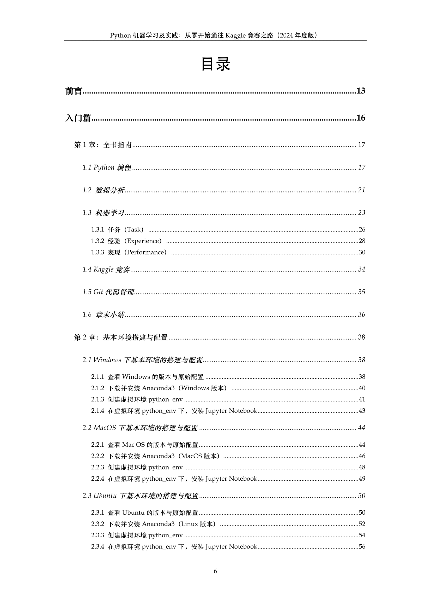
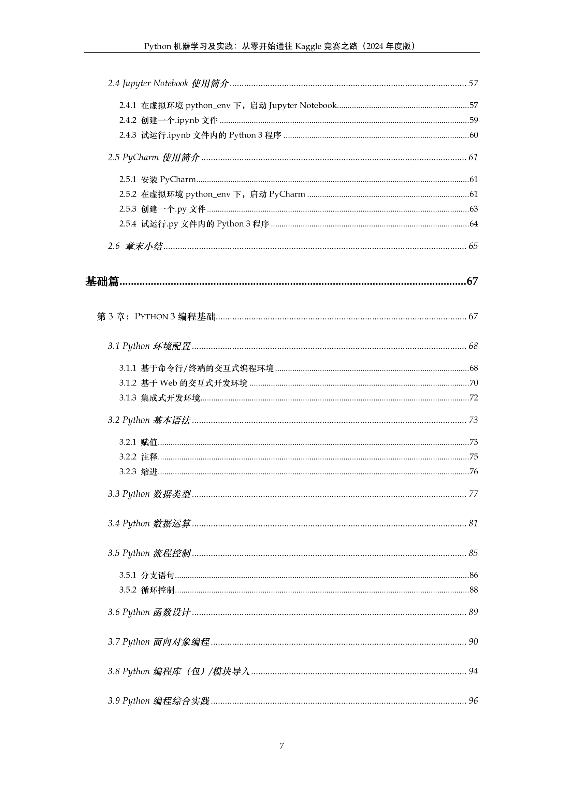
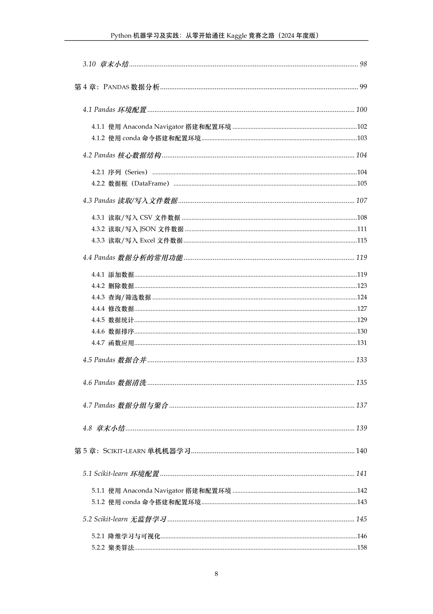
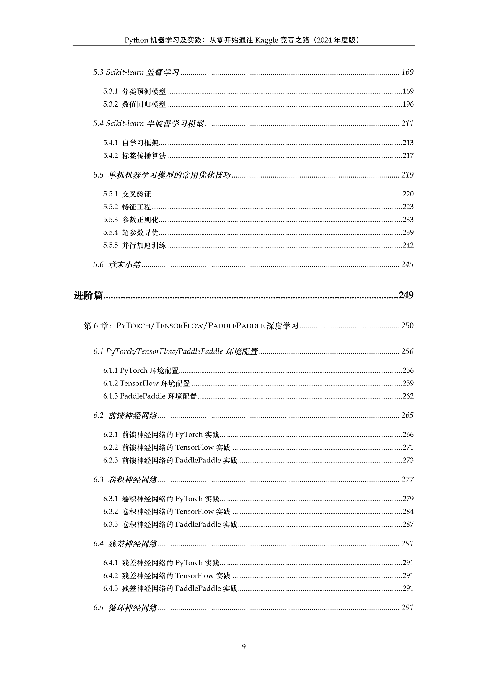
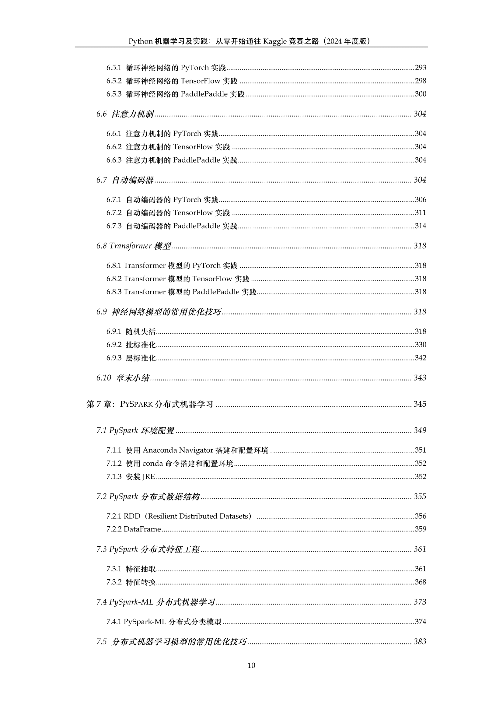
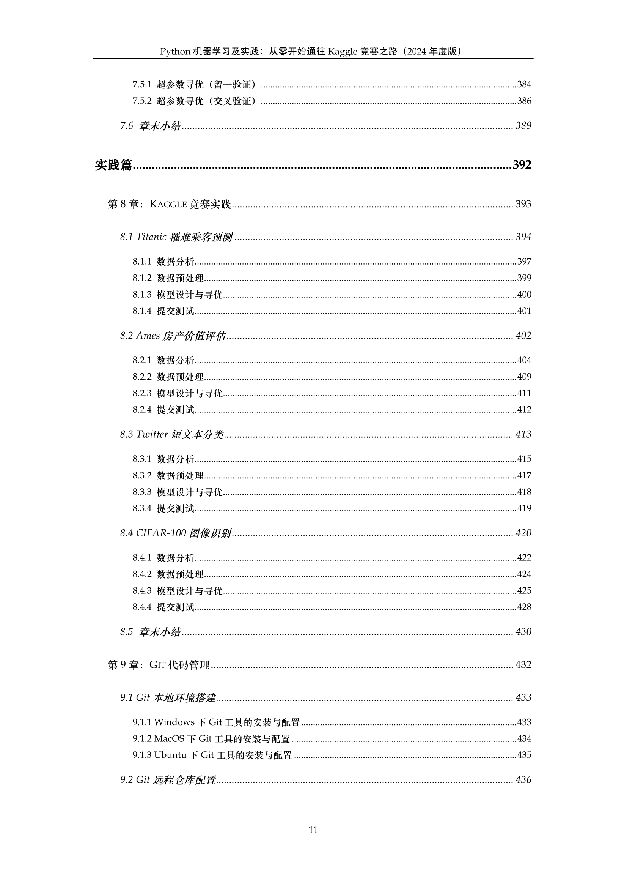
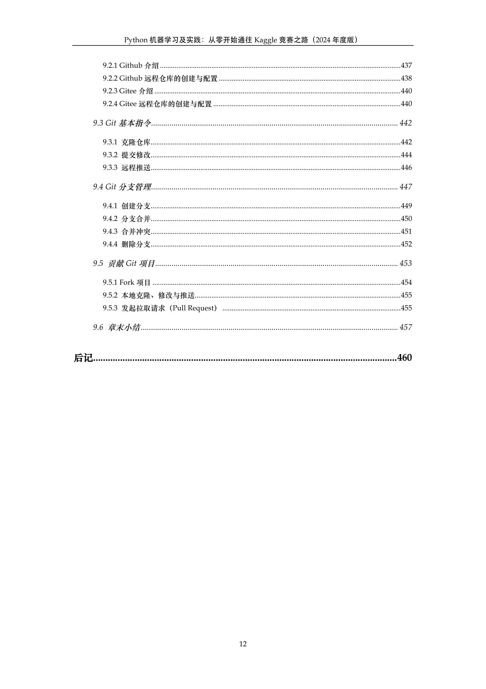

## 《Python人工智能编程实践（2024年度版）》

### 1. 全书概要

《Python人工智能编程实践（2024年度版）》（英文书名：《AI Programming with Python in Practice (2024 Edition)》）适合所有对人工智能（Artificial Intelligence）领域，特别是对机器学习（Machine Learning）、数据挖掘（Data Mining）、计算机视觉（Computer Vision），以及自然语言处理（Natural Language Processing）等技术的原理与实践感兴趣的初学者；也可以作为国家人工智能工程技术的职业教育培训、各省级人工智能专业职称评定，以及注册数据分析师认证（CDA、CPDA）等的参考书目。

在大数据时代，只要是与数据相关的从业人员，掌握Python编程、数据分析、乃至机器学习的能力，都是一个不错的职业加分项。不论是在金融、统计、数理研究、物理计算、社会科学、工业工程等领域的从业者；还是在互联网行业的程序员、数据分析师、运营人员、产品经理等，都会对本书有着不同程度的学习需求。

本书以Python3编程语言为基础，在不赘述大量数学模型与复杂编程知识的前提下，从零开始带领广大读者，逐步熟悉并且掌握当下最流行的基于Python的数据分析，以及支持单机、深度和分布式机器学习的开源程序库。这些热门的Python程序库包括：Pandas、Scikit-learn、PyTorch、TensorFlow、PaddlePaddle、PySpark-ML等。

全书共包括四大核心篇章，分别是：
- 入门篇：包括对全书核心概念的指南性介绍，以及在多种主流操作系统（Windows、MacOS，以及Ubuntu）上如何配置基本编程环境的详细说明。
- 基础篇：涵盖了Python 3.11的编程基础、基于Pandas 2.0的数据分析，以及使用Scikit-learn 1.3解决大量经典的单机（单核/多核）机器学习问题。
- 进阶篇：介绍如何使用PyTorch 2.0、TensorFlow 2.12，以及PaddlePaddle 2.5各自搭建多种深度学习网络框架，甚至是基于PySpark 3.4的ML编程库完成一些常见的分布式机器学习任务。
- 实践篇：利用全书所讲授的Python编程、数据分析，以及机器学习知识，从事Kaggle多种类型的竞赛实战。同时，介绍如何使用Git在Gitee与Github平台上管理和维护日常代码与编程项目。

全书基于Python3的所有实践代码和数据均已分别开源在Gitee和Github平台：
- 中国大陆地区的读者，推荐从Gitee平台下载： https://gitee.com/godfanmiao/PyAI-Gitee-2024
- 港、澳、台，及海外地区的读者，建议从Github平台下载：https://github.com/godfanmiao/PyAI-Github-2024

### 2. 作者介绍

#### 范淼 [(个人主页)](https://godfanmiao.github.io/homepage-zh/)：
- 四维图新集团（专家级）领军人才；高级工程师（职称：副高）
- 中国人民大学信息资源管理学院专业硕士导师
- 电子学会会员、测绘学会会员
- 清华大学软件学院博士后、计算机系工学博士
- 在国际顶级期刊、会议上发表论文20余篇，谷歌学术引用1100余次
- 获美国、中国发明专利授权30余项；软件著作权10余项

#### 徐晟桐 [(个人主页)](https://taylor-xst.github.io/website/)：
- 汽车之家高级产品经理；工程师（职称：中级）
- 澳洲国立大学经济学硕士、南开大学经济学学士
- 获日本、中国发明专利授权3项；GUI外观设计专利授权10余项

### 3. 书籍目录

### 4. 书友QQ群

